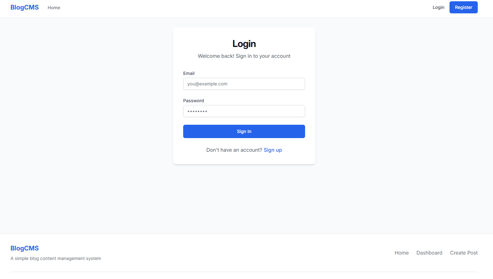
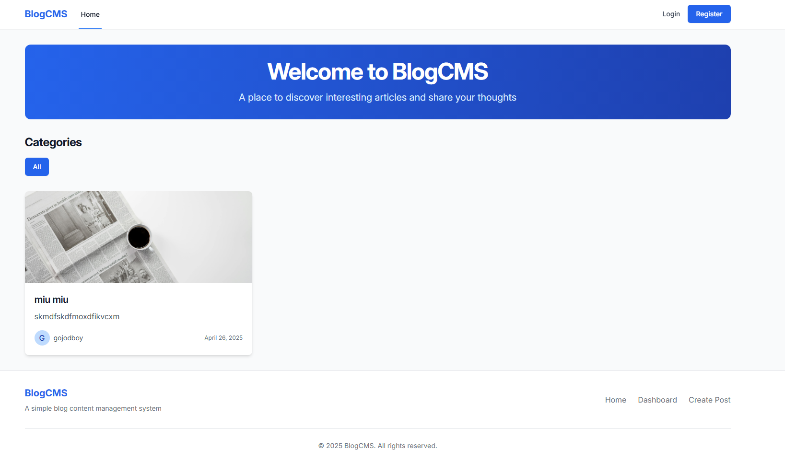
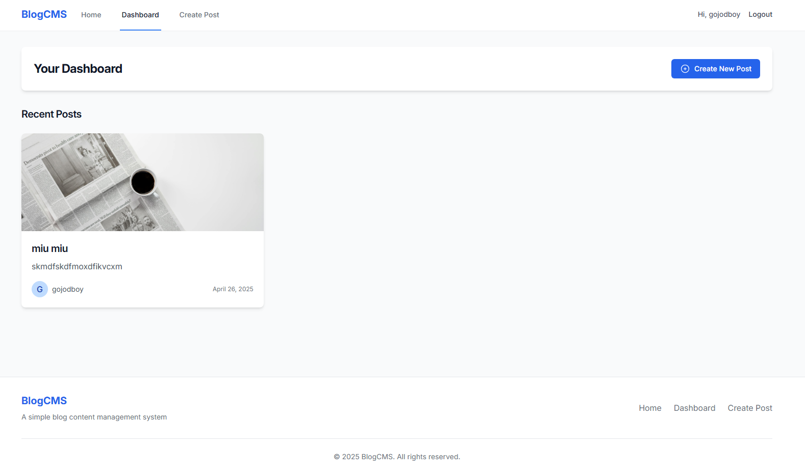
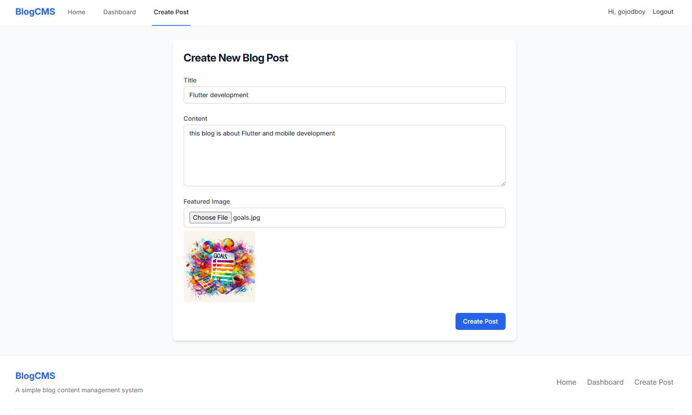

# Blog CMS

This is a TypeScript-based RESTful API backend for a Blog CMS application. Built using **Express**, **MongoDB**, and **Cloudinary**, it provides full support for user authentication, post management, comments, likes, category filtering, markdown rendering, and image uploads.

#### Login Page



#### Register Page


#### Hero Page



#### Dashboard



#### Create Post



---

## Tech Stack

- **TypeScript**
- **Express.js**
- **MongoDB (Mongoose)**
- **JWT for Authentication**
- **Cloudinary for Image Uploads**
- **Markdown Support**
- **CORS, Morgan, and Express Middleware**

---

## Folder Structure

```
src/
├── controllers/         # Business logic (auth, post, comment, etc.)
├── middleware/          # Middlewares (auth, error, rate limit)
├── model/               # Mongoose models for MongoDB
├── routes/              # Route handlers for all endpoints
├── utils/               # Utility functions (Cloudinary, etc.)
├── test/                # HTTP requests for testing using REST Client
└── server.ts            # Entry point of the server
```

---

## Features

### Authentication

- `POST /api/register` – Register user
- `POST /api/login` – Login with JWT

### Posts

- `GET /api/posts` – Get all posts
- `GET /api/posts/:id` – Get single post
- `POST /api/posts` – Create post (with image upload via Cloudinary)
- `PATCH /api/posts/:id` – Update post
- `DELETE /api/posts/:id` – Delete post
- `PATCH /api/posts/like/:postId/:userId` – Like/unlike post
- Markdown content rendering support

### 📷 Image Upload

- `POST /api/upload` – Upload image to Cloudinary
  - Accepts multipart/form-data

### Comments

- `POST /api/posts/:postId/comments` – Add comment to a post
- `GET /api/posts/:postId/comments` – Get comments of a post

### 🗂 Categories

- `GET /api/categories` – Fetch all categories
- `POST /api/categories` – Create category
- `GET /api/categories/:id` – Get single category
- `GET /api/categories/filter/:slug` – Get posts by category

---

## 🛠 Setup Instructions

### 1. Clone the Repository

```bash
git clone https://github.com/your-username/blog-cms-backend.git
cd blog-cms-backend
```

### 2. Install Dependencies

```bash
npm install
```

### 3. Create `.env` File

```env
PORT=5000
MONGO_URI=your_mongodb_connection_string
JWT_SECRET=your_jwt_secret
CLOUDINARY_CLOUD_NAME=your_cloud_name
CLOUDINARY_API_KEY=your_api_key
CLOUDINARY_API_SECRET=your_api_secret
```

### 4. Run the Server

```bash
npm run dev
```

The server should be running on: `http://localhost:5000`

---

## API Testing

This project includes test files in the `/test` folder (e.g., `login.http`, `setPost.http`) that can be used with the [REST Client](https://marketplace.visualstudio.com/items?itemName=humao.rest-client) extension in VS Code.

---

## Author Notes

- Likes are tracked per user using ObjectId comparison.
- Post content supports Markdown.
- Cloudinary integration is done in `/utils/cloudinary.ts`.
- All authentication routes are protected via middleware.
- Rate limiting middleware is added for security.

---
